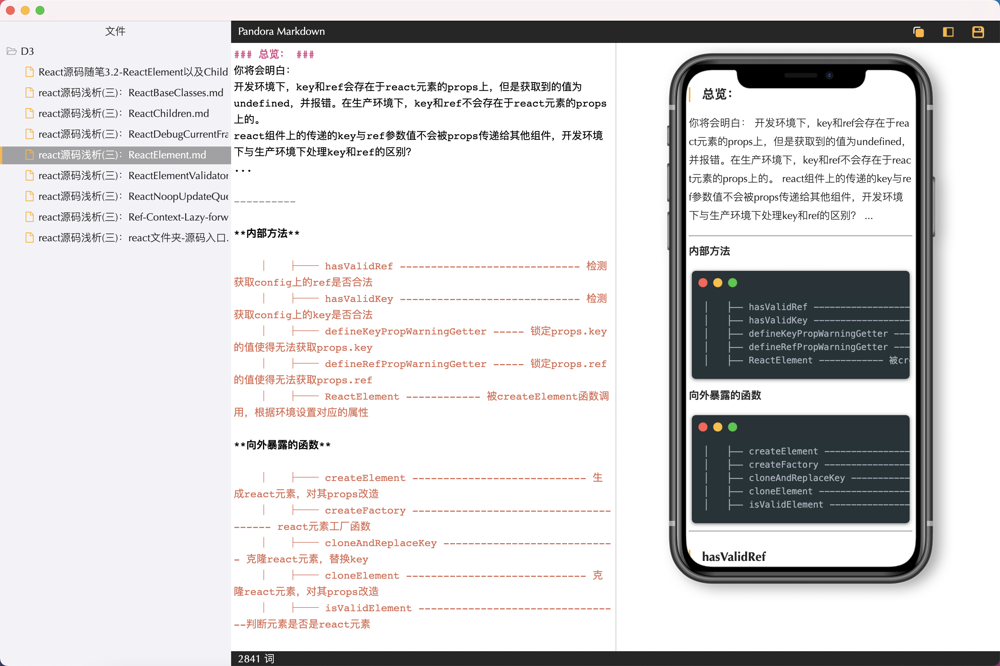

<div align=center>
    
</div>

> 基于 vscode 架构，利用 【依赖注入】【多进程】等思想实现，用于编辑 `markdown` 文件，并输出为 【微信公众号文章】

<div align=center>
    
</div>

# 工具集合
- [ ] 插件化
## markdown

### 文件功能
- [x] 搜索
- [x] 文件管理（保存，重命名，新建）
- [x] 大纲预览模式
- [ ] 导出 pdf,md,html
- [ ] 导入 pdf,md,html

### 转换成微信公众号
- [x] 默认主题
- [ ] 主题定制
- [ ] 图片排版
- [ ] 一键发布


## 代理工具
- [] ...
## 照片美化
- [] ...

# 开发 
- 安装依赖
1. 设置electron镜像
    ```
    yarn config set electron_mirror https://npm.taobao.org/mirrors/electron/
    ```
2. 安装依赖
    ```
    yarn
    ```

- 开发
1. yarn start:views
2. yarn start:workbench


- 打包成 mac:
yarn release:mac
